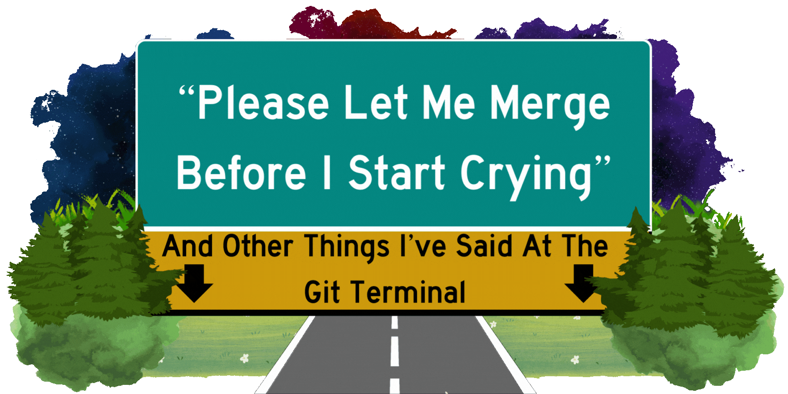

# **Resources for Please Let Me Merge Before I Start Crying: And Other Things I've Said at The Git Terminal**  

## **About**

This repository contains supplemental resources and materials that coincide with the *"Please Let Me Merge Before I Start Crying: And Other Things I've Said At The Git Terminal"* talk at [Posit::conf(2024)](https://reg.conf.posit.co/flow/posit/positconf24/publiccatalog/page/publiccatalog/session/1712003906159001eMTZ).

*"Please Let Me Merge"* is geared towards those who may feel comfortable working independently with Git but need some confidence when working collaboratively. Just like novice drivers can learn to confidently (and safely!) merge onto (seemingly) intimidating highways, those new to collaborating with Git can also conquer Git merges with some exposure and preparation.

This talk will go over:

-   Different ways R users can interact with Git

-   What Git merges and Git merge conflicts are

-   Real-life examples of Git merges

-   Advice on resolving Git merges

-   Suggestions for cleaner workflows to promote better Git merges

 

This repository serves as a resource for relevant supplemental materials for those seeking to learn more about improving their git workflows to reduce git merge conflicts.

------------------------------------------------------------------------

## **Slides and Talk Recording**

The slides for *"Please Let Me Merge"* can be found on this repository [here](https://meghansaha.github.io/please_let_me_merge/#/title-slide).

This talk will be presented on August 13th 2023, 2:40 PM PDT at the Hyatt Regency Seattle (Seattle, Washington) United States. A recording of this talk will be available on YouTube on a later date.

------------------------------------------------------------------------

## **Supplemental Resources**

*"Please Let Me Merge"* introduces three concepts *(**Communication**, **Workflow**, and **Knowledge**)* that can help collaborators assess, improve, and sustain their workflows within their teams. These concepts aim to mitigate the amount and severity of git merge conflicts experienced while collaborating through git.

### **Resources for Improving Communication**

#### Communicating with Others

-   [***How to Improve Your Communication Skills \| Data Science Hangout Highlights***](https://www.youtube.com/watch?v=SUZw5GjKNRg) (Video) - Posit PBC w/ Elaine McVey

-   [***How to Communicate as a Software Developer***](https://www.youtube.com/watch?v=lOvEOlCcMBI) (Video) - Peter Elbaum

-   [***Communication Is Just As Important As Code***](https://corgibytes.com/blog/2016/06/06/communication-and-code/) (Blog Post) - Andrea Goulet

-   [***How to Most Efficiently Communicate With Your Developers***](https://www.bairesdev.com/blog/developer-communication/) (Blog Post) - Luis Paiva

-   [***6 Tips for Improving Dev Team Communication and Collaboration***](https://semaphoreci.com/blog/dev-team-communication) (Blog Post) - Jenna Bunnell

#### Communicating within Code

-   [***Column Names as Contracts***](https://www.emilyriederer.com/post/column-name-contracts/) - (Blog Post) Emily Riederer

-   [***Tidyverse Style Guide***](https://style.tidyverse.org/index.html)

-   [***Google Style Guides***](https://google.github.io/styleguide/)

-   [***Code Sections - R Studio User Guide***](https://docs.posit.co/ide/user/ide/guide/code/code-sections.html)

-   [***Annotating Code Examples***](Annotating%20code%20examples) - GitHub Docs

#### Leveraging Developer Platforms

-   [***Creating a pull request template for your repository***](https://docs.github.com/en/communities/using-templates-to-encourage-useful-issues-and-pull-requests/creating-a-pull-request-template-for-your-repository) - GitHub Docs

-   [***Managing labels***](https://docs.github.com/en/issues/using-labels-and-milestones-to-track-work/managing-labels) - GitHub Docs

-   [***About issues***](https://docs.github.com/en/issues/tracking-your-work-with-issues/about-issues) - GitHub Docs

-   [***Pull Request Comments***](https://docs.github.com/en/pull-requests/collaborating-with-pull-requests/reviewing-changes-in-pull-requests/commenting-on-a-pull-request) - GitHub Docs

-   [***Branch Rules and Protection***](https://docs.github.com/en/repositories/configuring-branches-and-merges-in-your-repository/managing-protected-branches/managing-a-branch-protection-rule) - GitHub Docs

------------------------------------------------------------------------

### **Resources for Improving Workflows**

-   [***Comparing Git workflows: What you should know***](https://www.atlassian.com/git/tutorials/comparing-workflows) (Article) - Atlassian

-   [***What is a Git Workflow***](https://about.gitlab.com/topics/version-control/what-is-git-workflow/) (Article) - GitLab

-   [***Git Branching - Branching Workflows***](https://git-scm.com/book/en/v2/Git-Branching-Branching-Workflows) - git scm Documentation

-   [***The gitflow workflow - in less than 5 mins.***](https://www.youtube.com/watch?v=1SXpE08hvGs) - Devchild

-   [***Git patterns and anti-patterns for successful developers : Build 2018***](https://www.youtube.com/watch?v=ykZbBD-CmP8) (Video) - Microsoft Developer w/ Edward Thomson

-   The [***`usethis` package***](https://usethis.r-lib.org/index.html)'s [***Git functions***](https://usethis.r-lib.org/reference/index.html#git-and-github)

------------------------------------------------------------------------

### **Resources for Improving Git Knowledge**

#### For the Watchers\*

<i>(\*You need to **visually see** something to learn)</i>

-   [***Git Tutorial for Dummies***](https://www.youtube.com/watch?v=mJ-qvsxPHpY) (Video) - Nick White

-   [***Git, GitHub, & GitHub Desktop for beginners***](https://www.youtube.com/watch?v=8Dd7KRpKeaE) (Video) - Coder Coder

-   [***Resolve Git Merge Conflicts: The Definitive Guide***](https://www.youtube.com/watch?v=Sqsz1-o7nXk) (Video) - The Modern Coder

#### For the Readers\*

<i>\*You need to **carefully read** something to learn)</i>

-   [***Git Reference Manual***](https://git-scm.com/docs)

-   [***Git Pro Book***](https://git-scm.com/book/en/v2) - Scott Chacon and Ben Straub

-   [***Happy Git with R***](https://happygitwithr.com/) - Jenny Bryan

#### For the Doers\*

<i>(\*You need to **do something** tangible to learn)</i>

-   [***saperlipopette Package***](https://maelle.github.io/saperlipopette/index.html) - Maelle Salmon

-   [***Learn Git Branching Site***](https://learngitbranching.js.org/) - Peter Cottle

-   [***Oh My Git Game***](https://ohmygit.org/) - bleeptrack and blinry

-   [***Oh S%\@t Git***](https://ohshitgit.com/) \| [***Oh Danggit Git***](https://dangitgit.com/en) - Katie Sylor-Miller

#### For the Skimmers\*

<i>(\*You need **to skim** for what you need to learn)</i>

-   [***RStudio/Git/GitHub Cheat Sheet***](https://rstudio.github.io/cheatsheets/git-github.pdf)

-   [***GitHub Git Cheat Sheet***](https://education.github.com/git-cheat-sheet-education.pdf)

-   [***Practical Git***](https://practicalgit.com/) - Foad Lind
